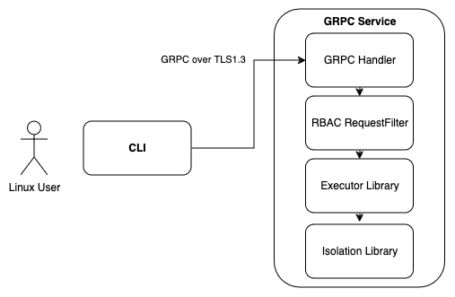
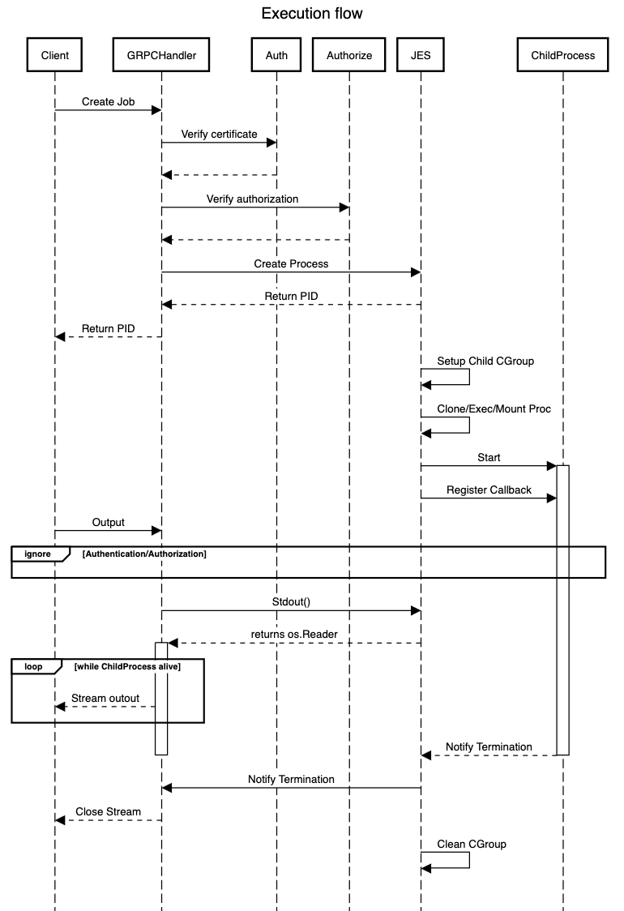

# RFD 1 - Process Executor Service
## What

The Process Executor Service (JES) is a simple service designed to handle the execution of isolated Linux processes using namespaces and cgroups.

The goal is to support the following API by a library, a GRPC service and CLI:
* **Get**: Retrieve the status of a process.
* **Start**: Initiate a new process.
* **Stdout**: Stream the output of a process directly to the user.
* **Stop**: Stop a running process.

JES comprises three components:
  * Library - manages the child processes (cgroups, namespaces, lifecycle)
  * GRPC Service - offers an API Backend with defined GRPC APIs and provides Authorization, Authentication and Encryption
  * CLI - A commandline for users to interact with the Service

For the exercise all three components are part of the same golang module but residing in different packages.

## Why
This serves as a clever interview task for newcomers.

## Details
### High level components diagram


### Execution flows diagram


### Executor Library

#### API
```golang
// State will represent the process state (WAITING, RUNNING, ABORTED, COMPLETED)
type State int
const (
    ABORTED State = iota
    COMPLETED
    RUNNING
    WAITING
)

// ProcInfo represents a Process status to the calling client
type ProcInfo struct {
  // Id is a monotonic Process identifier as we don't expect to execute at a big scale
  // Clients of the library will see this ID as Process ID and not real Linux Pid.
  ID           uint64
  // CreatedAt reports the time the process was created
  CreatedAt    time.Time
  // Error reports if the process has terminated with non 0 exit status
  Error        err
  // OsPid represent the Linux process ID of the child
  OsPid        int
  // StartedAt represents the process was started
  StartedAt    time.Time
  // State represents the process state (WAITING, RUNNING, ABORTED, COMPLETED)
  State        State
  // TerminatedAt is the time he process was terminated
  TerminatedAt time.Time
}

// ProcessConfig represents any process that can be started, stopped and monitored
type ProcessConfig struct {
  // Binary executable to start
  Cmd string
  // Args is a slice of arguments to pass to Cmd
  Args []string
  // CPUPercent represents the quota of cpu to use for all cores. We would't assume the user knows
  // the number of cores available so the minimum value is 1 and max is 100. 
  CPUPercent int
  // MemoryMB represents the quota of memory to in Megabytes, it will be applied as Memory High in the CGroup
  MemoryMB int
  // ReadBPS represents the maximum bytes for second the process can read
  ReadBPS int
  // WriteBPS represents the maximum bytes for second the process can read 
  WriteBPS int
}

// Executor is a simple Process executor for Linux that guarantees isolation between
// children with the use of linux namespaces [https://man7.org/linux/man-pages/man7/namespaces.7.html] 
// NOTE: This component is unbounded as it's not a requirement in the feature request doc, normally 
// process should be inserted into a bounded queue and only 'MaxProcs' would run concurrently.
type Executor struct {
}

//Get returns a process by it's id, returns nil if id does not exists
func (e *Executor) Get(p int) ProcInfo

// Start starts a process and executes it immediately,
// returns a process ID or error is returned if the process can not be started
// NOTE: I would normally make this call blocking if the Process intake Queue has reached capacity.
func (e *Executor) Start(p ProcessConfig) (int, error)

// Stdout returns a io.Reader to the process standard output
// and will return nil if not processId is invalid
// The returned io.Reader will return EOF only when the child process terminates
// emulating the behavior of "docker logs -f"
func (e *Executor) Stdout(p int) io.Reader

// Stop terminates the process and cleans up it's CGroup and namespaces
func (e *Executor) Stop(p int)
```

#### Process isolation
This feature is offered by the kernel's [namespaces](https://man7.org/linux/man-pages/man7/namespaces.7.html) , the executor library Parent process can *clone()*  (or *unshare()*) itself and then execute the child in the new namespaces just created.

Creation of a namespace happens by calling *unshare*, *clone* or *setns* and. once created it, the namespace will exist while there is a Pid or Thread associated.

Namespace support in golang is offered by the *exec.CommandWithContext()*, with the attribute *syscall.SysProcAttr*:
*Cmd.Start* will first execute *clone()* on the parent and *unshare()* on child() process. [reference](https://cs.opensource.google/go/go/+/refs/tags/go1.22.3:src/os/exec/exec.go;drc=f7f266c88598398dcf32b448bcea2100e1702630;l=616)


As we are assuming child command doesn't require network access, [as per discussion on slack](https://goteleport.slack.com/archives/C073UPN767M/p1715905480886399), a `veth` won't be created in the process sandbox.

Namespaces cleanup is not required as they disappear when the last PID or Thread in them exits.

Process sandbox creation needs a helper executable because of the following limitations encountered:
1. after running [few experiments](https://gist.github.com/bejelith/8c3c0ca3f48299f54bcdfc4b11f1466f) using *syscall.Unshare()*, is that it's not possible to associate a thread (in a multithreaded process) to new FS and Mount namespace so the parent process will have to use *clone()*.

2. *clone()* is not part of Golang public Apis, we are left with *exec.Command()* which does not allow any code execution between *clone()* and *execve()* making it impossible to execute *mount()* to hide system processes from the child. (Reimplementing exec.Command could be an option)

3. We need an intermediate process to setup the sandbox before the user-submitted command is executed.

The solution found is to *exec.Command* a child Helper process to setup the new namespace using the same binary the library is loaded into using "/proc/self/exe" as executable.
The helper process will be confined inside the package's *init()* and complete execution (os.Exit) before *main()* is reached, here an example:
```golang 
func main() {
	flag.Parse()
	ctx := context.Background()
	// Do not share root /proc to child processes
	if err := syscall.Mount("", "/proc", "proc", syscall.MS_PRIVATE, ""); err != nil {
		fmt.Println("Mount error:", err)
		os.Exit(1)
	}

	cmd := exec.CommandContext(ctx, "/proc/self/exe")
	cmd.SysProcAttr = &syscall.SysProcAttr{
		Cloneflags: syscall.CLONE_NEWNS | syscall.CLONE_NEWPID | syscall.CLONE_NEWNET,
	}
	cmd.Env = append(cmd.Env, "JES_CHILD=true", "CMD=/bin/bash", "ARGS_0=-c", "ARGS_1=ps aux")
	cmd.Stdout = os.Stdout
	cmd.Stderr = os.Stdout
	cmd.Run()
}

func init() {
  // Evaluate ISCHILD and other ENV parameters, processEnvironment parses ISCHILD, CMD and the list of ARGS_X
  cmd, args, isChild, err := processEnvironment(os.Environ())
	if !isChild {
		fmt.Println("I am the parent")
		return
	}
  if err != nil {
    fmt.Println("error:", err)
    return
  }
	fmt.Println("I am the child")

	defer os.Exit(2)

	// We are in the new namespace after Clone/Exec so mount /proc
	err := syscall.Mount("", "/proc", "proc", syscall.CLOCAL, "")
	if err != nil {
		fmt.Println("mount", err)
		return
	}

	// Exec allows us to retain PID 1 so that the output of `ps` looks cooler
	execErr := syscall.Exec(cmd, args, []string{"PATH=/bin:/usr/sbin/"})
  if execErr != nil {
		fmt.Println("error executing command", cmd, args)
	}
}

```
the code will yield
```
[simone.caruso@ip-172-31-20-250 teleport]$ sudo ./cmd
Im am the parent
I am the child
    PID TTY          TIME CMD
      1 pts/1    00:00:00 bash
      4 pts/1    00:00:00 ps
1: lo: <LOOPBACK> mtu 65536 qdisc noop state DOWN mode DEFAULT group default qlen 1000
    link/loopback 00:00:00:00:00:00 brd 00:00:00:00:00:00
```
The advantages of using init() to run the helper child are:
* limit our scope to Golang public APIs
* no need of external binaries that would not make the library usable

#### Process resource limits (cgroups)
Child processes resource limits will limited byCGroups, the executor library will be responsible for creating a new CGroup for each child executed.  
JES will create a parent cgroup for it's own PID and register all children in their own cgroups:
`/sys/fs/cgroups/JES_$PID/child_$CHILDPID`
The cgroups will be cleared when the service terminates.

In the case of JES crashes the left over cgroups shall be deleted by a new starting instance using the "/sys/fs/JES_\d+" pattern.

The Cgroup association will be performed when the library will call *exec.Command()* to crete the Helper child described in the [Process isolation](#process-isolation) paragraph by setting *CgroupFD* in the *syscall.SysProcAttr* structure.

**NOTES**  
CGroups have two different APIs so supporting both is necessary if running on older distros but for this implementation i'm reducing the scope to Amazon Linux 2023 which uses cgroup v2.  
For simplicity we will cleanup cgroups when the parent process exits, this of course doesn't scale well as we might run into Operative System FD limits.

#### Output API
*read()* and similar io calls do return EOF when the end of a file but it not possible to tell if there is another process appending further data to it.

The requirement is to stop waiting for more Standard Output when the process dies.

The idea is to build a custom io.Reader for each Output() request, the reader would start at offset 0 of the output file which is on filesystem.
When EOF is reached the io.Reader will keep polling the Process status until both EOF and child death are reached.

NOTE: as we are not designing this for scalability it's acceptable to poll, however a better implementation would use two channels, one to notify process death and the second to notify of changes in the underlying file.
Other possible improvements are the use *fsnotify* or [inotify](https://man7.org/linux/man-pages/man7/inotify.7.html).  
In case file descriptor counts are too high another option could be to keep the Process output in a memory buffer and have each Output caller maintain it's own read offset into that buffer.

### GRPC Service

#### Protobuf definition
```protobuf
syntax = "proto3";

option go_package = "goteleport/pb";

package v1;

service Scheduler {
  rpc Get(google.protobuf.UInt32Value) returns (GetResponse);
  rpc Start(CreateRequest) returns (CreateResponse);
  rpc Stdout(OutputRequest) returns (stream OutputResponse);
  rpc Stop(StopRequest) returns (StopResponse);
}

message GetResponse {
  bool found = 1;
  uint64 pid = 2;
  string status = 3;
}

message ResourceLimits {
  cpuPercentage int = 1;
  memoryMB int = 2;
  readBPS int = 3;
  writeBPS int = 4;
}

message CreateRequest {
  string name = 1;
  string cmd = 2;
  repeated string args = 3;
  ResourceLimits limits = 4;
}

message CreateResponse {
  option uint64 pid = 1;
  option string error = 2;
}

message OutputRequest {
  uint64 pid = 1;
}

message OutputResponse {
  string output = 1;
}

message StopRequest {
  uint64 pid = 1;
}

message StopResponse {
}
```

#### Authentication
The requirement is to enable mTLS authentication for GRPC clients.
mTLS authentication will request the client to present a valid certificate to the server which will verify it against the CA chain [RFC8446](https://datatracker.ietf.org/doc/html/rfc8446#section-4.3.2).  
This is enabled by configuring the server side TLS lister in **RequireAndVerify** mode, in golang:
```golang
credentils.NewTLS(
    &tls.Config{
        ClientAuth:   tls.RequireAndVerifyClientCert,
    }
)
```

#### Authorization
TLS Certificates do carry metadata, the *Subject* field identifies the entity that owns the certificate (we can call it the user for this exercise) ref. to [x509.Certificate](https://pkg.go.dev/crypto/x509#Certificate).
The Subject field is of type pkix.Name:
```golang
package pkix
type Name struct {
	Country, Organization, OrganizationalUnit []string
	Locality, Province                        []string
	StreetAddress, PostalCode                 []string
	SerialNumber, CommonName                  string
...
}
```
Extraction of user identifiers is performed by customized GRPC UnaryInterceptor and StreamInterceptor eg:
```golang
if p, ok := peer.FromContext(ctx); ok {
    tlsInfo, success := p.AuthInfo.(credentials.TLSInfo)
    if success && len(tlsInfo.State.PeerCertificates) > 0 {
      entityId := tlsInfo.State.PeerCertificates[0].Subject.CommonName
    }
}
```
*As a convention* we assume the **CommonName identifies the user** calling the API.

Users will be able to access the standard output of Processes they have launched.

#### Encryption & TLS
TLS1.2 is still in use today is many application and good implementation requires today to only a subset of safe  
ciphers but we only have one client, which is also in our control,  we can safely assume we only need to support TLS1.3.

TLS1.3 has deprecated several unsecure Ciphers from TLS1.2 so as of today we assume TLS1.3 default settings are safe so the following config would suffice:
```golang
&tls.Config{
    MinVersion:tls.VersionTLS13,
}
```

For testing we will produce a CA certificate, a set of client certificates and one server certificate. 
I plan to write two scripts:
1. buildca.sh to build a CA and a server certificates
2. buildcert.sh to build a new client certificate


#### Reliability considerations and possible improvements 
I felt it is important to at least mention metrics and observability even if it's not part of the project goal plus other things to consider when building services in my experience.

* Metrics exported under a /metrics endpoints
  * Job duration histogram 
  * Job execution error rate
  * Average number of running jobs
  * Authentication failures
  * Authorization failures 

* Logging (using the new golang logging API)
  * User logins
  * User RBAC errors
  * Failed commands
* Liveness endpoints
* Rate limiting / backpressure / Exponential backoff with jitter / Setup network timeouts

### CLI
The CLI will parse commandline flags and arguments and build GRPC requests against the Server.

The authentication is performed by mTLS so we expect the user to provide a valid certificate to the CLI.

#### CLI usage  
`./client [flags] [[COMMAND] arguments]`

**COMMAND** is any of
* CREATE [binary] [arguments]
* STOP [ProcessID]
* STATUS [ProcessID]
* OUTPUT [ProcessID]

**Flags are**  
**-cert**: certificate file (defaults to ./client.pem)
**-server** grpc server addr:port (defaults to "127.0.0.1:8080")
#### Examples
```shell
# NOTE: Flag parsing stops just before the first non-flag argument ("-" is a non-flag argument)
# or  after the terminator "--" (https://pkg.go.dev/flag)  
./client -server 127.0.0.1:8080 -cert certfile start ls -l
./client -server 127.0.0.1:8080 -cert certfile status $PID
./client -server 127.0.0.1:8080 -cert certfile output $PID  
./client -server 127.0.0.1:8080 -cert certfile stop $PID  
```
##### Error codes
* **0:** Used for successful exits for any 2xx response from the server.
Server  
* **1:** Used for all network IO errors and 4xx and 5xx HTTP response codes.


### Build process toolchain
The plan here is to simply use a Makefile to build the protobuf components and then rely on the golang tool chain (build, install, gofmt, etc) to produce the binaries.

The whole project is shipped as single module in a real work scenario i see the library component to be shipped as separate golang module yet still residing on the same 'monorepo'.

In regard of repeatable builds Go modules takes care of managing dependencies and makes their versions are consistent across builds by saving versions and hashes in the `go.sum` file.
